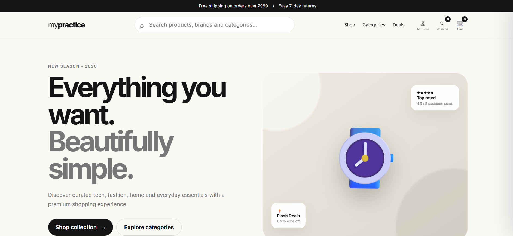

# 🛍️ MyPractice — Modern E-Commerce Shopping UI

A modern, responsive **dummy e-commerce website** built with **HTML, CSS, and JavaScript**.
This project is designed as a frontend practice project and is inspired by the polished experience of modern online shopping platforms.

> ⚠️ **Demo project:** No real payments, orders, authentication, or backend services are connected.

## ✨ Features

* 🏠 Modern e-commerce homepage
* 🎨 Clean and responsive UI
* ✨ Smooth animations and hover effects
* 🔎 Live product search with suggestions
* 🗂️ Product categories
* 🔥 Limited-time deals section
* ⏱️ Animated countdown timer
* 🛍️ Product catalogue
* 🔃 Product sorting
* 🎯 Category and price filters
* ❤️ Wishlist functionality
* 🛒 Interactive shopping cart
* ➕➖ Cart quantity controls
* 🗑️ Remove products from cart
* 📦 Product details modal
* 💳 Demo checkout interface
* 👤 Demo account modal
* 📧 Newsletter subscription interaction
* 🔔 Toast notifications
* 💾 Cart and wishlist persistence using `localStorage`
* 📱 Mobile-friendly responsive design
* ⌨️ Keyboard-friendly modal closing with `Escape`

## 🛠️ Technologies Used

| Technology   | Purpose                                 |
| ------------ | --------------------------------------- |
| HTML5        | Website structure                       |
| CSS3         | Styling, responsive layout & animations |
| JavaScript   | Interactions and application logic      |
| LocalStorage | Persisting cart & wishlist              |
| Google Fonts | Inter typography                        |

## 📁 Project Structure

```text
mypractice-shop/
│
├── index.html       # Main webpage
├── styles.css       # Website styling and animations
├── script.js        # Shopping functionality
└── README.md        # Project documentation
```

## 🚀 Run Locally

### Option 1 — Open directly

Simply open:

```text
index.html
```

in your browser.

### Option 2 — Run a local server

If Python is installed:

```bash
python3 -m http.server 5500
```

Then open:

```text
http://localhost:5500
```

## 📱 Responsive Design

The website is designed to work across:

* 💻 Desktop
* 💻 Laptop
* 📱 Mobile
* 📟 Tablet

## 🛒 Demo Shopping Flow

You can:

```text
Browse products
      ↓
Search / Filter
      ↓
Open product details
      ↓
Add to cart
      ↓
Change quantities
      ↓
Proceed to checkout
      ↓
Place demo order
```

No real transaction takes place.

## 💾 LocalStorage

The project uses browser `localStorage` to remember:

* Shopping cart
* Wishlist

This means your cart and wishlist remain available after refreshing the page.

## 🎯 Purpose

This project was created for:

* Frontend development practice
* HTML/CSS/JavaScript learning
* E-commerce UI experimentation
* Responsive web design practice
* GitHub portfolio projects
* Learning client-side shopping-cart functionality

## 🔮 Future Improvements

Possible future additions:

* [ ] Backend API
* [ ] User authentication
* [ ] Real product database
* [ ] Admin dashboard
* [ ] Product reviews
* [ ] Product pagination
* [ ] Advanced filters
* [ ] Dark mode
* [ ] Real payment integration
* [ ] Order history
* [ ] User profiles
* [ ] Database integration
* [ ] REST API
* [ ] Search engine optimization
* [ ] Progressive Web App support

## 📸 Screenshots

Add screenshots of your website here after uploading them to the repository.

Example:

```markdown

```

## ⚖️ Disclaimer

This project is a **practice/demo e-commerce website**.

It is not affiliated with or intended to imitate any specific commercial shopping platform. Product names, prices, and content are fictional/demo content.

No real payments or purchases are processed.

## 👨‍💻 Author

**MyPractice**

Built for learning and experimenting with modern frontend development.

---

⭐ If you found this project useful, consider giving the repository a star!
