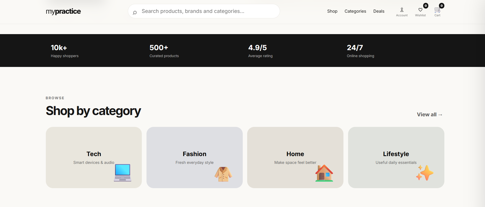

# 🛍️ MyPractice

A modern, responsive **e-commerce practice website** built with HTML, CSS and JavaScript.

> ⚠️ Demo project — no real payments, orders, accounts or backend are connected.

## ✨ Features

- Responsive modern UI
- 🔎 Product search & suggestions
- 🗂️ Categories & filters
- ↕️ Product sorting
- ❤️ Wishlist
- 🛒 Shopping cart
- ➕➖ Quantity controls
- 📦 Product details
- 💳 Demo checkout
- ⏱️ Countdown deal timer
- 🔔 Toast notifications
- 💾 LocalStorage
- 📱 Mobile responsive
- ✨ Smooth animations

## 🛠️ Built With

- HTML5
- CSS3
- JavaScript
- LocalStorage
- Google Fonts

## 📸 Screenshots




## 🚀 Run Locally

### Clone the repository

```bash
git clone https://github.com/YOUR-USERNAME/mypractice-shop.git
cd mypractice-shop
python3 -m http.server 5500
```
